worldwide energy usage
================

## Research Topic (Title):

The Relationship Between Population Growth, Energy Demand, and Renewable
Transition in Developing Nations

## Team members:

Prudvik Seemakurthi, Nate Riedl

### Data:

**Source:** The dataset comes from Our World in Data (OWID) — a research

and publication platform based at the University of Oxford and the
Oxford Martin School. Link: <https://ourworldindata.org/energy>

**Description:** - This dataset provides a global, long-term view of
energy

production, consumption, and emissions for over 200 countries and
territories, spanning from the 1960s to 2023.  
- It integrates multiple aspects of the global energy system,
covering: - Total and per-capita energy consumption (in terawatt-hours,
TWh)  
- Energy production and electricity generation by source (coal, oil,
gas, renewables, nuclear, etc.)  
- Carbon dioxide (CO₂) emissions and carbon intensity of electricity  
- Fossil fuel and renewable shares in energy consumption  
- Economic and demographic indicators (GDP and population)

### Some of the important variables include:

| **Variable Name** | **Description** |
|----|----|
| `country` | Name of the country or region |
| `iso_code` | Three-letter ISO country code |
| `year` | Year of the observation |
| `population` | Total population of the country (from UN data) |
| `gdp` | Gross Domestic Product (constant international dollars, PPP-adjusted) |
| `primary_energy_consumption` | Total primary energy used (TWh) |
| `energy_per_capita` | Energy use per person (TWh or MWh per capita) |
| `fossil_fuel_consumption` | Total fossil fuel energy use (TWh) |
| `fossil_share_energy` | Share (%) of fossil fuels in total energy use |
| `renewables_consumption` | Renewable energy use (TWh) |
| `renewables_share_energy` | Share (%) of renewables in total energy use |
| `electricity_generation` | Total electricity generation (TWh) |
| `carbon_intensity_elec` | CO₂ emitted per unit of electricity generated (gCO₂/kWh) |
| `energy_per_gdp` | Energy use per unit of GDP (TWh per \$GDP) |

### Questions to Be Addressed (Fleshed Out Project Idea):

# Goal:

To analyze how population size and economic development influence energy
demand, emissions, and the transition to renewables. with a focus on
identifying developing nations achieving renewable growth despite low
GDP.

# Research Questions:

1.  Population & Energy: How does population size affect total energy
    demand across countries?

2.  Population Growth & Fossil Dependence: Are countries with rapid
    population growth relying more on fossil fuels?

3.  Clean Energy & Economic Development: How does access to renewable
    (clean) energy correlate with GDP and energy per capita?

4.  Renewable Growth in Developing Nations: Which developing nations
    show the strongest renewable expansion despite low GDP?

5.  Energy Consumption & Time: How has the amount of fossil fuel vs
    renewable consumed changed over time?

6.  Electricity Generation: Which countries have had the highest
    electricity generation over the years and how does this compare to
    their fossil fuel and renewable energy consumption?

# Expected Outcomes:

Identify patterns showing whether high population correlates with higher
emissions or energy demand. Evaluate if developing nations are catching
up in renewable energy use. Visualize global disparities in renewable
adoption and fossil fuel dependence. Highlight countries that have made
significant clean energy progress despite economic challenges.

``` r
library(tidyverse)
```

    ## Warning: package 'ggplot2' was built under R version 4.5.2

    ## ── Attaching core tidyverse packages ──────────────────────── tidyverse 2.0.0 ──
    ## ✔ dplyr     1.1.4     ✔ readr     2.1.5
    ## ✔ forcats   1.0.0     ✔ stringr   1.5.1
    ## ✔ ggplot2   4.0.0     ✔ tibble    3.3.0
    ## ✔ lubridate 1.9.4     ✔ tidyr     1.3.1
    ## ✔ purrr     1.1.0     
    ## ── Conflicts ────────────────────────────────────────── tidyverse_conflicts() ──
    ## ✖ dplyr::filter() masks stats::filter()
    ## ✖ dplyr::lag()    masks stats::lag()
    ## ℹ Use the conflicted package (<http://conflicted.r-lib.org/>) to force all conflicts to become errors

``` r
df <- read_csv("owid-energy-data.csv")
```

    ## Rows: 23195 Columns: 130
    ## ── Column specification ────────────────────────────────────────────────────────
    ## Delimiter: ","
    ## chr   (2): country, iso_code
    ## dbl (128): year, population, gdp, biofuel_cons_change_pct, biofuel_cons_chan...
    ## 
    ## ℹ Use `spec()` to retrieve the full column specification for this data.
    ## ℹ Specify the column types or set `show_col_types = FALSE` to quiet this message.

``` r
-
dim(df)
```

    ## [1] -23195   -130

``` r
#colnames(df)
#unique(df$country)
head(df)
```

    ## # A tibble: 6 × 130
    ##   country        year iso_code population   gdp biofuel_cons_change_pct
    ##   <chr>         <dbl> <chr>         <dbl> <dbl>                   <dbl>
    ## 1 ASEAN (Ember)  2000 <NA>             NA    NA                      NA
    ## 2 ASEAN (Ember)  2001 <NA>             NA    NA                      NA
    ## 3 ASEAN (Ember)  2002 <NA>             NA    NA                      NA
    ## 4 ASEAN (Ember)  2003 <NA>             NA    NA                      NA
    ## 5 ASEAN (Ember)  2004 <NA>             NA    NA                      NA
    ## 6 ASEAN (Ember)  2005 <NA>             NA    NA                      NA
    ## # ℹ 124 more variables: biofuel_cons_change_twh <dbl>,
    ## #   biofuel_cons_per_capita <dbl>, biofuel_consumption <dbl>,
    ## #   biofuel_elec_per_capita <dbl>, biofuel_electricity <dbl>,
    ## #   biofuel_share_elec <dbl>, biofuel_share_energy <dbl>,
    ## #   carbon_intensity_elec <dbl>, coal_cons_change_pct <dbl>,
    ## #   coal_cons_change_twh <dbl>, coal_cons_per_capita <dbl>,
    ## #   coal_consumption <dbl>, coal_elec_per_capita <dbl>, …

# Basic cleaning:

1.  keeping relevant columns

``` r
energy_clean <- df %>%
  select(country, iso_code, year, population, gdp,
         fossil_fuel_consumption, renewables_consumption,
         fossil_share_energy, renewables_share_energy,
         energy_per_capita, energy_cons_change_twh, energy_cons_change_pct, 
         electricity_generation)
```

2.  This step filters the dataset to keep data from 1990 onwards,
    removes regions like continents and the world totals.

``` r
energy_clean <- energy_clean %>%
  filter(year >= 1990) %>%
  filter(!country %in% c("World", "Asia", "Europe", "Africa",
                         "North America", "South America", 
                         "Oceania", "European Union (27)")) %>%
  filter(!is.na(population))
```

3.This step groups the data by country and arranges it by year, then
calculates each country’s total energy demand, yearly population growth
rate, and the ratio of renewable to fossil fuel consumption.

``` r
energy_clean <- energy_clean %>%
  group_by(country) %>%
  arrange(year) %>%
  mutate(
    total_energy_demand = fossil_fuel_consumption + renewables_consumption,
    pop_growth_rate = (population - lag(population)) / lag(population) * 100,
    renew_fossil_ratio = renewables_consumption / fossil_fuel_consumption,
  )%>% ungroup()
length(unique(energy_clean$country))
```

    ## [1] 230

4.  This step filters out rows where the total energy demand is missing
    or equal to zero, keeping only valid and meaningful energy data for
    analysis.

``` r
energy_clean <- energy_clean %>%
  filter(!(is.na(total_energy_demand) | total_energy_demand == 0))
```

# Summary:

``` r
summary(energy_clean %>%
          select(population, total_energy_demand,
                 fossil_share_energy, renewables_share_energy,
                 energy_per_capita, gdp))
```

    ##    population        total_energy_demand fossil_share_energy
    ##  Min.   :2.548e+05   Min.   :   19.27    Min.   : 13.87     
    ##  1st Qu.:5.551e+06   1st Qu.:  209.80    1st Qu.: 78.39     
    ##  Median :2.030e+07   Median :  459.55    Median : 88.53     
    ##  Mean   :1.446e+08   Mean   : 2932.61    Mean   : 84.57     
    ##  3rd Qu.:6.153e+07   3rd Qu.: 1370.82    3rd Qu.: 97.03     
    ##  Max.   :3.122e+09   Max.   :73999.43    Max.   :100.00     
    ##                                                             
    ##  renewables_share_energy energy_per_capita       gdp           
    ##  Min.   : 0.000          Min.   :   626.2   Min.   :5.222e+09  
    ##  1st Qu.: 1.633          1st Qu.: 16997.6   1st Qu.:1.262e+11  
    ##  Median : 6.175          Median : 31961.7   Median :3.011e+11  
    ##  Mean   :11.287          Mean   : 42746.3   Mean   :9.732e+11  
    ##  3rd Qu.:16.065          3rd Qu.: 53906.4   3rd Qu.:8.098e+11  
    ##  Max.   :86.126          Max.   :318587.3   Max.   :2.697e+13  
    ##                                             NA's   :265

1.  Global Average Across all years:

``` r
energy_clean %>%
  summarise(
    avg_population = mean(population, na.rm = TRUE),
    avg_energy_demand = mean(total_energy_demand, na.rm = TRUE),
    avg_fossil_share = mean(fossil_share_energy, na.rm = TRUE),
    avg_renew_share = mean(renewables_share_energy, na.rm = TRUE),
    avg_energy_per_capita = mean(energy_per_capita, na.rm = TRUE)
  )
```

    ## # A tibble: 1 × 5
    ##   avg_population avg_energy_demand avg_fossil_share avg_renew_share
    ##            <dbl>             <dbl>            <dbl>           <dbl>
    ## 1     144642029.             2933.             84.6            11.3
    ## # ℹ 1 more variable: avg_energy_per_capita <dbl>

2.  Average of Key Variables for Each Year

``` r
yearly_summary <- energy_clean %>%
  group_by(year) %>%
  summarise(
    avg_population = mean(population, na.rm = TRUE),
    avg_energy_demand = mean(total_energy_demand, na.rm = TRUE),
    avg_fossil_share = mean(fossil_share_energy, na.rm = TRUE),
    avg_renew_share = mean(renewables_share_energy, na.rm = TRUE),
    avg_energy_per_capita = mean(energy_per_capita, na.rm = TRUE)
  )

yearly_summary %>%
  pivot_longer(cols = starts_with("avg_"),
               names_to = "variable",
               values_to = "value") %>%
  ggplot(aes(x = year, y = value, color = variable)) +
  geom_line(size = 1) +
  facet_wrap(~ variable, scales = "free_y", ncol = 2) +
  labs(
    title = "Average Global Energy Indicators by Year",
    x = "Year",
    y = "Average Value"
  ) +
  theme_minimal() +
  theme(legend.position = "none")
```

    ## Warning: Using `size` aesthetic for lines was deprecated in ggplot2 3.4.0.
    ## ℹ Please use `linewidth` instead.
    ## This warning is displayed once every 8 hours.
    ## Call `lifecycle::last_lifecycle_warnings()` to see where this warning was
    ## generated.

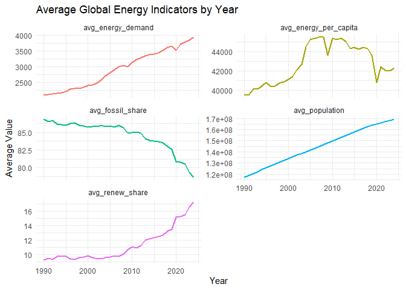<!-- -->

3.  Most Recent Year Summary:

``` r
latest_year <- max(energy_clean$year, na.rm = TRUE)

energy_clean %>%
  filter(year == latest_year) %>%
  summarise(
    num_countries = n_distinct(country),
    total_global_energy = sum(total_energy_demand, na.rm = TRUE),
    avg_fossil_share = mean(fossil_share_energy, na.rm = TRUE),
    avg_renew_share = mean(renewables_share_energy, na.rm = TRUE),
    avg_energy_per_capita = mean(energy_per_capita, na.rm = TRUE)
  )
```

    ## # A tibble: 1 × 5
    ##   num_countries total_global_energy avg_fossil_share avg_renew_share
    ##           <int>               <dbl>            <dbl>           <dbl>
    ## 1            82             324347.             78.6            17.3
    ## # ℹ 1 more variable: avg_energy_per_capita <dbl>

``` r
energy_clean %>%
  filter(year == latest_year) %>%
  arrange(desc(total_energy_demand)) %>%
  select(country, population, total_energy_demand, fossil_share_energy) %>%
  head(10)
```

    ## # A tibble: 10 × 4
    ##    country                    population total_energy_demand fossil_share_energy
    ##    <chr>                           <dbl>               <dbl>               <dbl>
    ##  1 Upper-middle-income count… 2860327104              72753.                81.4
    ##  2 High-income countries      1420171960              72609.                79.5
    ##  3 China                      1419321230              47377.                80.3
    ##  4 United States               345426519              24342.                80.3
    ##  5 Lower-middle-income count… 3122336562              16811.                88.9
    ##  6 India                      1450935728              11143.                89.7
    ##  7 Russia                      144820370               8481.                88.2
    ##  8 Japan                       123752991               4556.                83.0
    ##  9 Brazil                      211998503               3787.                49.4
    ## 10 Canada                       39742378               3614.                67.4

4.  Correlation

``` r
energy_clean %>%
  filter(year == latest_year) %>%
  summarise(
    corr_pop_energy = cor(population, total_energy_demand, use = "complete.obs"),
    corr_pop_fossil = cor(population, fossil_share_energy, use = "complete.obs")
  )
```

    ## # A tibble: 1 × 2
    ##   corr_pop_energy corr_pop_fossil
    ##             <dbl>           <dbl>
    ## 1           0.765          0.0939

``` r
write_csv(energy_clean, "energy_clean.csv")
```

# Population & Energy: How does population size affect total energy demand across countries?

``` r
pop_energy <- energy_clean %>%
  filter(year == latest_year) %>%
  select(country, population, total_energy_demand)


cor(pop_energy$population, pop_energy$total_energy_demand, use = "complete.obs")
```

    ## [1] 0.7653674

there is a strong correlation between population and energy demand.

## Population and Total Energy Demand

``` r
pop_energy %>%
  ggplot(aes(x = population, y = total_energy_demand)) +
  geom_point(color = "steelblue", alpha = 0.6) +
  geom_smooth(method = "lm", color = "red", se = TRUE) +
  scale_x_log10(labels = scales::comma) +
  scale_y_log10(labels = scales::comma) +
  labs(
    title = "Population vs Total Energy Demand (Latest Year)",
    x = "Population",
    y = "Total Energy Demand (TWh, log scale)"
  ) +
  theme_minimal()
```

    ## `geom_smooth()` using formula = 'y ~ x'

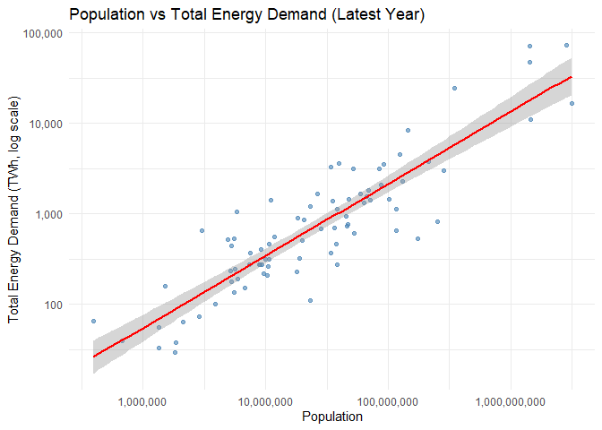<!-- -->

The graph shows that countries with bigger populations use more energy.
As population increases, total energy demand also rises. The red line
shows this clear upward trend. This means that when a country’s
population grows, its need for energy also grows, showing that
population strongly affects energy use.

## Population and Total Energy Demand

``` r
energy_clean %>%
  group_by(year) %>%
  summarise(
    correlation = cor(population, total_energy_demand, use = "complete.obs")
  ) %>%
  ggplot(aes(x = year, y = correlation)) +
  geom_line(color = "darkorange", size = 1.2) +
  labs(
    title = "Yearly Correlation Between Population and Energy Demand",
    x = "Year",
    y = "Correlation Coefficient (r)"
  ) +
  theme_minimal()
```

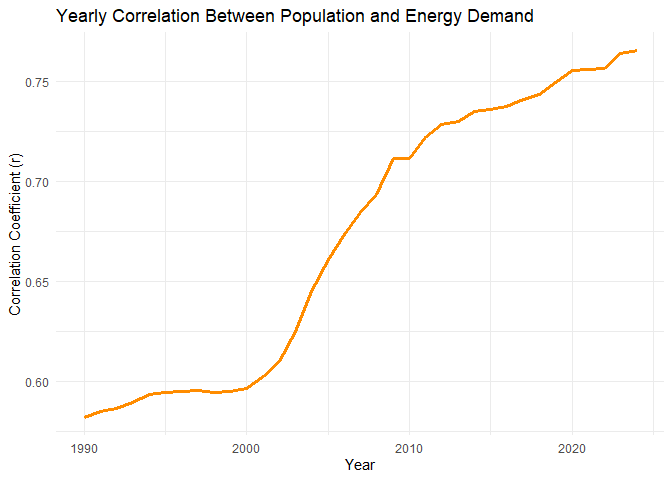<!-- -->

From 1990 to 2025, the correlation steadily increases from about 0.6 to
above 0.75. This means that population size and energy demand are
becoming more closely connected, showing that growing populations drive
higher energy use worldwide. \## Total Energy Demand and Population
Growth Over Time

``` r
countries_to_plot <- c("China", "India", "United States", "Germany", "Japan", "Russia", "Brazil")
library(patchwork)
```

    ## Warning: package 'patchwork' was built under R version 4.5.2

``` r
# Filter data
data_subset <- energy_clean %>%
  filter(country %in% countries_to_plot)

# Energy Demand Plot
p1 <- ggplot(data_subset, aes(x = year, y = total_energy_demand, color = country)) +
  geom_line(size = 1.1) +
  labs(
    title = "Total Energy Demand Over Time",
    x = "Year", y = "Energy Demand (TWh)", color = "Country"
  ) +
  theme_minimal() +
  theme(plot.title = element_text(face = "bold", size = 13))

# Population Plot
p2 <- ggplot(data_subset, aes(x = year, y = population / 1e6, color = country)) +
  geom_line(size = 1.1, linetype = "dashed") +
  labs(
    title = "Population Growth Over Time",
    x = "Year", y = "Population (Millions)", color = "Country"
  ) +
  theme_minimal() +
  theme(plot.title = element_text(face = "bold", size = 13))


p1 + p2
```

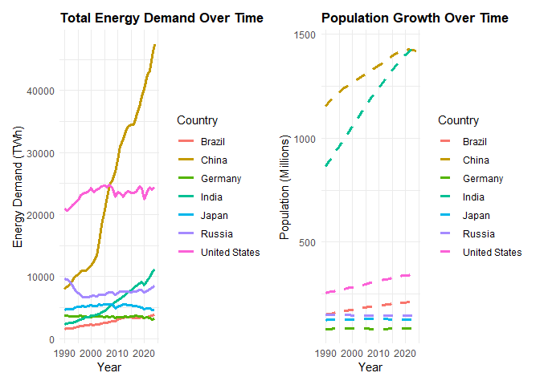<!-- -->

China and India show steep rises in both population and energy demand,
while the United States and developed nations stay stable. This shows
that fast-growing countries are driving much of the increase in global
energy use.

## Population and Energy Use Per Capita

``` r
energy_clean %>%
  ggplot(aes(x = population, y = energy_per_capita)) +
  geom_point(alpha = 0.6, color = "darkgreen") +
  geom_smooth(method = "lm", color = "red") +
  scale_x_log10(labels = scales::comma) +
  labs(
    title = "Population vs Energy Use Per Capita",
    x = "Population (log scale)",
    y = "Energy per Capita (kWh per person)"
  ) +
  theme_minimal()
```

    ## `geom_smooth()` using formula = 'y ~ x'

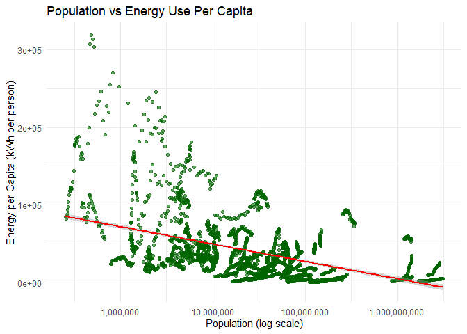<!-- -->

Countries with smaller populations tend to use more energy per person,
while highly populated countries use less per person. The downward slope
of the red line suggests that larger populations often have lower energy
use per capita.

\#Are countries with rapid population growth relying more on fossil
fuels?

## Population Growth and Fossil Fuel Dependence:

``` r
library(tidyverse)

# Filter valid data
pop_fossil <- energy_clean %>%
  filter(!is.na(pop_growth_rate) & !is.na(fossil_share_energy)) %>%
  group_by(country) %>%
  summarise(
    avg_pop_growth = mean(pop_growth_rate, na.rm = TRUE),
    avg_fossil_share = mean(fossil_share_energy, na.rm = TRUE)
  )

# Scatterplot
ggplot(pop_fossil, aes(x = avg_pop_growth, y = avg_fossil_share)) +
  geom_point(color = "darkorange", alpha = 0.7) +
  geom_smooth(method = "lm", color = "red", se = TRUE) +
  labs(
    title = "Population Growth vs Fossil Fuel Dependence",
    x = "Average Population Growth Rate (%)",
    y = "Average Fossil Fuel Share of Energy (%)"
  ) +
  theme_minimal()
```

    ## `geom_smooth()` using formula = 'y ~ x'

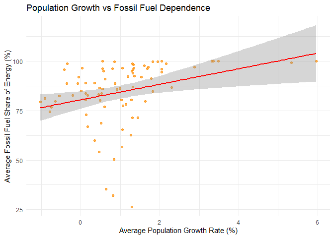<!-- -->

This graph shows a positive relationship between population growth and
fossil fuel use. Countries with faster-growing populations tend to rely
more on fossil fuels for energy. The upward red line indicates that as
population growth increases, the share of fossil fuels in total energy
consumption also rises.

``` r
cor(pop_fossil$avg_pop_growth, pop_fossil$avg_fossil_share, use = "complete.obs")
```

    ## [1] 0.2979841

## Fossil Fuel Share of Energy Over Time

``` r
countries_to_plot2 <- c("India", "Nigeria", "China", "United States")

energy_clean %>%
  filter(country %in% countries_to_plot2) %>%
  ggplot(aes(x = year)) +
  geom_line(aes(y = fossil_share_energy, color = country), size = 1.1) +
  labs(
    title = "Fossil Fuel Share of Energy Over Time",
    x = "Year", y = "Fossil Fuel Share (%)"
  ) +
  theme_minimal()
```

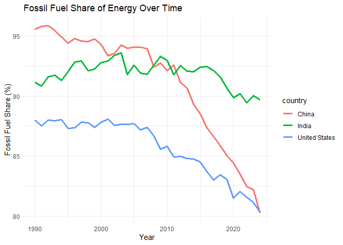<!-- -->

This graph shows changes in fossil fuel use for China, India, and the
United States from 1990 to 2025. China and the U.S. have both reduced
their fossil fuel share over time, while India’s share has stayed mostly
stable. This suggests slower energy transition in fast-growing countries
like India.

## Fossil Fuel Share by Population Growth Category

``` r
energy_clean %>%
  filter(!is.na(pop_growth_rate)) %>%
  group_by(country) %>%
  summarise(
    avg_pop_growth = mean(pop_growth_rate, na.rm = TRUE),
    avg_fossil_share = mean(fossil_share_energy, na.rm = TRUE)
  ) %>%
  mutate(
    growth_group = case_when(
      avg_pop_growth < 0.5 ~ "Low Growth",
      avg_pop_growth < 1.5 ~ "Moderate Growth",
      TRUE ~ "High Growth"
    )
  ) %>%
  ggplot(aes(x = growth_group, y = avg_fossil_share, fill = growth_group)) +
  geom_boxplot() +
  labs(
    title = "Fossil Fuel Share by Population Growth Category",
    x = "Population Growth Group",
    y = "Fossil Fuel Share (%)"
  ) +
  theme_minimal() +
  theme(legend.position = "none")
```

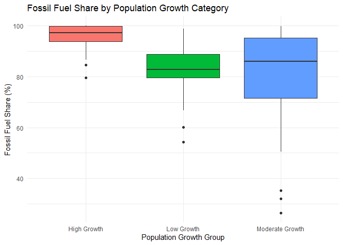<!-- -->

This boxplot compares fossil fuel dependence across countries with
different population growth rates. High-growth nations show the highest
fossil fuel share, often close to 100%, while low-growth countries rely
less on fossil fuels. This suggests that rapidly growing populations
depend more on nonrenewable energy to meet increasing demand.

## Yearly Correlation Between Population Growth and Fossil Fuel Use

``` r
cor_yearly <- energy_clean %>%
  filter(!is.na(pop_growth_rate) & !is.na(fossil_share_energy)) %>%
  group_by(year) %>%
  summarise(correlation = cor(pop_growth_rate, fossil_share_energy))

ggplot(cor_yearly, aes(x = year, y = correlation)) +
  geom_line(color = "darkblue", size = 1.2) +
  labs(
    title = "Yearly Correlation Between Population Growth and Fossil Fuel 
                                                                      Use",
    x = "Year",
    y = "Correlation Coefficient (r)"
  ) +
  theme_minimal()
```

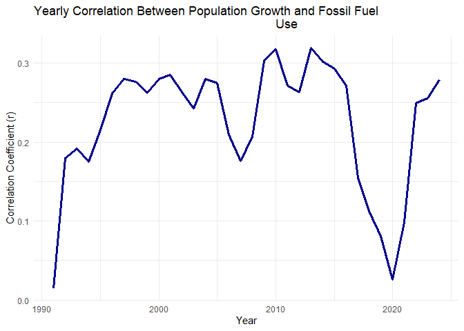<!-- -->

This graph shows how the link between population growth and fossil fuel
use has changed from 1990 to 2025. The correlation remains mostly
positive but weak, meaning countries with faster population growth tend
to rely slightly more on fossil fuels. The relationship also fluctuates
over time, showing shifting energy trends.

## Fossil Fuel Energy Share by Region

``` r
region_data <- energy_clean %>%
  filter(year >= 2000) %>%
  mutate(region = case_when(
    country %in% c("China", "India", "Japan", "Indonesia") ~ "Asia",
    country %in% c("Nigeria", "South Africa", "Egypt") ~ "Africa",
    country %in% c("United States", "Canada", "Mexico") ~ "North America",
    country %in% c("Germany", "France", "UK", "Italy") ~ "Europe",
    TRUE ~ "Other"
  ))

region_data %>%
  group_by(region, year) %>%
  summarise(
    avg_fossil_share = mean(fossil_share_energy, na.rm = TRUE)
  ) %>%
  ggplot(aes(x = year, y = avg_fossil_share, color = region)) +
  geom_line(size = 1.2) +
  labs(
    title = "Fossil Fuel Share by Region (2000–2025)",
    x = "Year", y = "Average Fossil Fuel Share (%)"
  ) +
  theme_minimal()
```

    ## `summarise()` has grouped output by 'region'. You can override using the
    ## `.groups` argument.

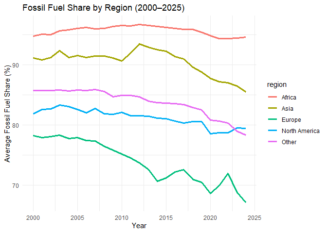<!-- -->

This graph compares fossil fuel dependence across regions from 2000 to
2025. Africa and Asia have the highest fossil fuel shares, showing
continued reliance on nonrenewable energy. In contrast, Europe and North
America show steady declines, indicating greater progress toward
renewable energy adoption and cleaner energy transitions.

### How does access to renewable (clean) energy correlate with GDP and energy per capita?

``` r
library(tidyverse)

energy_clean <- energy_clean %>%
  mutate(
    gdp_per_capita = gdp / population
  )
```

## GDP per Capita and Renewable Energy Share

``` r
library(ggplot2)

ggplot(energy_clean, aes(x = gdp_per_capita, y = renewables_share_energy)) +
  geom_point(alpha = 0.6, color = "darkgreen") +
  geom_smooth(method = "lm", color = "red", se = TRUE) +
  scale_x_log10(labels = scales::comma) +
  labs(
    title = "GDP per Capita vs Renewable Energy Share",
    x = "GDP per Capita (log scale, USD)",
    y = "Renewable Energy Share (%)"
  ) +
  theme_minimal()
```

    ## `geom_smooth()` using formula = 'y ~ x'

    ## Warning: Removed 265 rows containing non-finite outside the scale range
    ## (`stat_smooth()`).

    ## Warning: Removed 265 rows containing missing values or values outside the scale range
    ## (`geom_point()`).

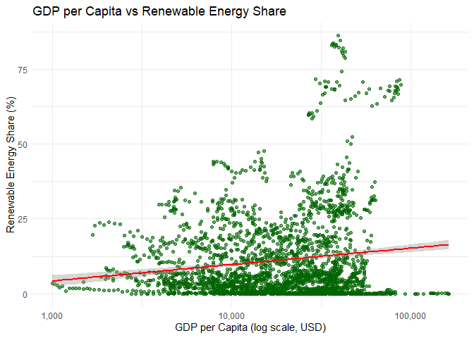<!-- -->

This graph shows a slight positive relationship between GDP per capita
and renewable energy share. Wealthier countries generally have higher
renewable energy use, though the trend is weak. This suggests that while
economic growth supports cleaner energy adoption, other factors like
policy and technology also play key roles.

## Average Renewable Energy Share by Income Group

``` r
energy_clean %>%
  filter(!is.na(gdp_per_capita)) %>%
  mutate(
    income_group = case_when(
      gdp_per_capita < 5000 ~ "Low Income",
      gdp_per_capita < 20000 ~ "Middle Income",
      TRUE ~ "High Income"
    )
  ) %>%
  group_by(income_group) %>%
  summarise(avg_renewable = mean(renewables_share_energy, na.rm = TRUE)) %>%
  ggplot(aes(x = income_group, y = avg_renewable, fill = income_group)) +
  geom_col() +
  labs(
    title = "Average Renewable Energy Share by Income Group",
    x = "Income Group",
    y = "Average Renewable Share (%)"
  ) +
  theme_minimal() +
  theme(legend.position = "none")
```

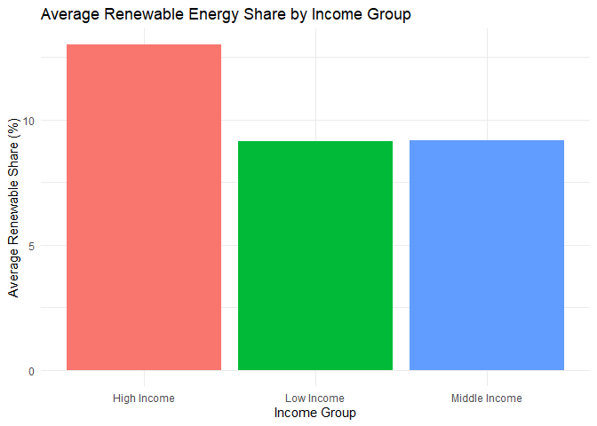<!-- -->

This bar chart shows that high-income countries have the highest average
renewable energy share, followed by middle- and low-income nations. The
pattern suggests that wealthier countries are better equipped to invest
in renewable energy technologies, while lower-income countries still
depend more on traditional fossil fuel sources.

## Yearly Correlation Between GDP per Capita and Renewable Energy Share

``` r
cor_yearly <- energy_clean %>%
  filter(!is.na(gdp_per_capita) & !is.na(renewables_share_energy)) %>%
  group_by(year) %>%
  summarise(
    correlation = if (n() > 1)
      cor(gdp_per_capita, renewables_share_energy, use = "complete.obs")
    else
      NA_real_
  )

ggplot(cor_yearly, aes(x = year, y = correlation)) +
  geom_line(color = "blue", size = 1.2) +
  labs(
    title = "Yearly Correlation Between GDP per Capita and 
                                                  Renewable Energy Share",
    x = "Year", y = "Correlation Coefficient (r)"
  ) +
  theme_minimal()
```

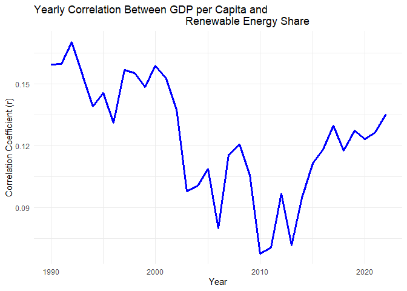<!-- -->

This graph tracks how the connection between economic growth and
renewable energy adoption has changed over time. The correlation remains
weak but generally positive, showing that as countries become wealthier,
they slightly increase their renewable energy use. However, the
fluctuations suggest varying national priorities and energy policies.

# Energy Consumption & Time

## How has the amount of fossil fuel vs renewable consumed changed over time for all countries?

``` r
energy_clean |> 
  group_by(year) |> 
  ggplot(aes(x = year, y = fossil_fuel_consumption)) +
  geom_col()
```

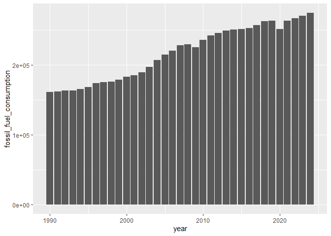<!-- -->

``` r
energy_clean |> 
  group_by(year) |> 
  ggplot(aes(x = year, y = renewables_consumption)) +
  geom_col()
```

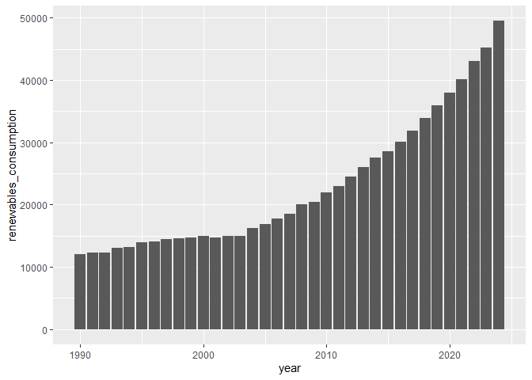<!-- --> According to
these graphs, it appears that the total fossil fuel consumption for all
of the countries in this data set has increased at a relatively steady
rate over the past 3 decades. In terms of renewable energy, consumption
has been on the rise since around 2004 with 2024 having an especially
large increase.

## Fossil fuel vs renewable energy consumption compared between continents

``` r
cont <- read_csv('country_data.csv')
```

    ## Rows: 250 Columns: 11
    ## ── Column specification ────────────────────────────────────────────────────────
    ## Delimiter: ","
    ## chr (7): name, region, subregion, latlng, timezones, numericCode, regionalBlocs
    ## dbl (4): population, area, gini, numberOfLanguages
    ## 
    ## ℹ Use `spec()` to retrieve the full column specification for this data.
    ## ℹ Specify the column types or set `show_col_types = FALSE` to quiet this message.

``` r
colnames(cont)[1] <- 'country'
colnames(cont)[2] <- 'continent'

energy_clean |> select(country) |> anti_join(cont |> select(country, continent), by = 'country') |> View()

cont$country[62] <- 'Czechia'
cont$country[108] <- 'Iran'
cont$country[133] <- 'North Macedonia'
cont$country[186] <- 'Russia'
cont$country[166] <- 'North Korea'
cont$country[211] <- 'South Korea'
cont$country[239] <- 'United Kingdom'
cont$country[240] <- 'United States'
cont$country[244] <- 'Venezuela'
cont$country[245] <- 'Vietnam'

energy_continents <- energy_clean |> left_join(cont |> select(country, continent), by = 'country')


energy_continents |> 
  group_by(year, continent) |> 
  filter(!is.na(continent)) |> 
  ggplot(aes(x = year, y = fossil_fuel_consumption)) +
  geom_col() +
  facet_wrap(~continent, scales = 'free_y') +
  ggtitle('Total Fossil Fuel Consumption')
```

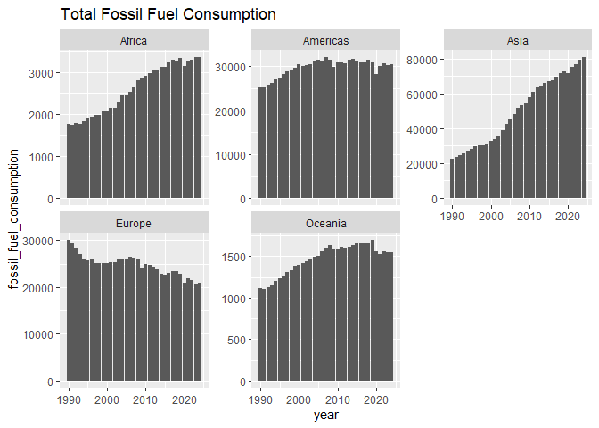<!-- -->

``` r
energy_continents |> 
  group_by(year, continent) |> 
  filter(!is.na(continent)) |> 
  ggplot(aes(x = year, y = renewables_consumption)) +
  geom_col() +
  facet_wrap(~continent, scales = 'free_y') +
  ggtitle('Total Renewable Energy Consumption')
```

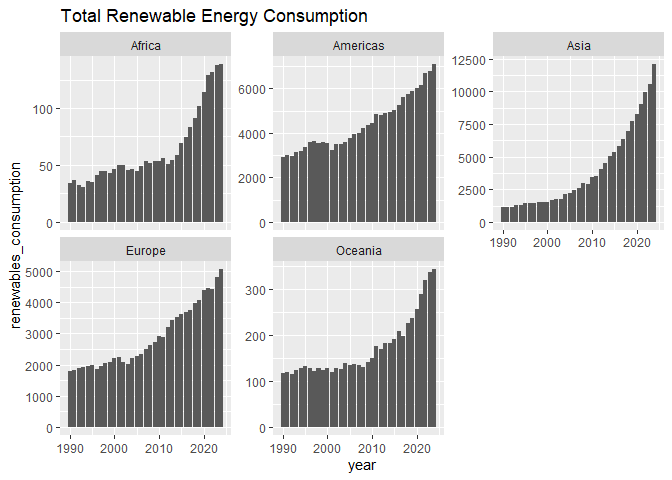<!-- -->

Based off of these graphs, Asia appears to have experienced the greatest
increase in fossil fuel consumption out of all of the continents, and
the most recent data shows that Asia now consumes the highest amount of
fossil fuel compared to the rest of the continents. The graphs also show
that the Americas, Oceania, and Africa experienced an increase in fossil
fuel consumption, however for Oceania and the Americas the amount of
fossil fuels consumed leveled off around 2005 with decreases observed
starting around 2015.

For renewable energy, all of the continents experienced a noticeable
increase in consumption starting around 2005. Out of all of the
countries, Africa and Oceania appear to have the lowest levels of yearly
renewable energy consumption while Asia appears to have the highest
according to the most recent data.

# Electricity Generation

## Which countries have had the highest electricity generation over the years?

``` r
top_electric <- energy_continents |> 
  select(country, electricity_generation, continent) |> 
  filter(!is.na(continent)) |> 
  group_by(country) |> 
  summarise(total_e = sum(electricity_generation, na.rm = T)) |> 
  arrange(desc(total_e))

top_10_electric <- top_electric[1:10, ]

energy_clean |> 
  filter(country %in% top_10_electric$country) |> 
  ggplot(aes(x = year, y = electricity_generation, color = country)) +
  geom_line() +
  ggtitle('Top Electricity-Generating Countries')
```

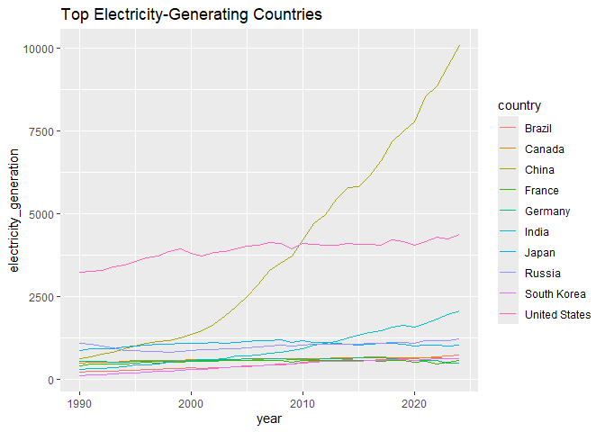<!-- --> Looking at
the top producers of electricity in the past decade, it appears that
China by far produces the greatest amount of electricity out of all the
countries in the data set. The United States initially produced the
greatest amount of electricity from 1990 to around 2008, where it was
surpassed by China. Most of these countries appear to produce a
relatively consistent amount of electricity each year, however both
China and India have had noticeable increases over the past few decades.

## How does electricity generation compare to fossil fuel and renewable energy consumption?

``` r
top_10_electric |> 
  ggplot(aes(x = reorder(country, desc(total_e)), y = total_e)) +
  geom_col() +
  ylab('Total Electricity Produced') +
  ggtitle('Top 10 Electricity-Producing Countries') +
  xlab('country')
```

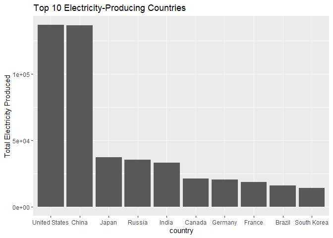<!-- -->

``` r
top_fossil <- energy_continents |> 
  select(country, fossil_fuel_consumption, continent) |> 
  filter(!is.na(continent)) |> 
  group_by(country) |> 
  summarise(total_fossil = sum(fossil_fuel_consumption)) |> 
  arrange(desc(total_fossil))

top_10_fossil <- top_fossil[1:10, ]

top_10_fossil |> 
  ggplot(aes(x = reorder(country, desc(total_fossil)), y = total_fossil)) +
  geom_col() +
  ylab('Total Fossil Fuel Consumed') +
  ggtitle('Top 10 Fossil Fuel Consuming Countries') +
  xlab('country')
```

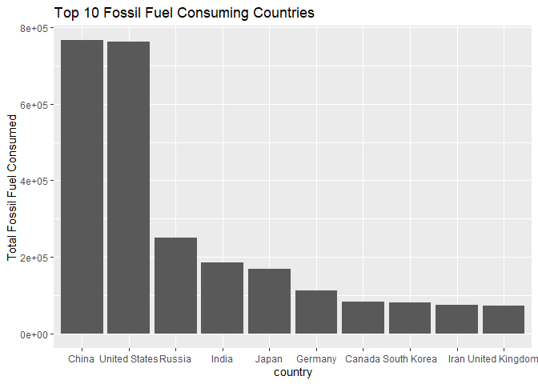<!-- -->

``` r
top_renewable <- energy_continents |> 
  select(country, renewables_consumption, continent) |> 
  filter(!is.na(continent)) |> 
  group_by(country) |> 
  summarise(total_renewable = sum(renewables_consumption)) |> 
  arrange(desc(total_renewable))

top_10_renewable <- top_renewable[1:10, ]

top_10_renewable |> 
  ggplot(aes(x = reorder(country, desc(total_renewable)), y = total_renewable)) +
  geom_col() +
  ylab('Total Renewable Energy Consumed') +
  ggtitle('Top 10 Renewable Energy Consuming Countries') +
  xlab('country')
```

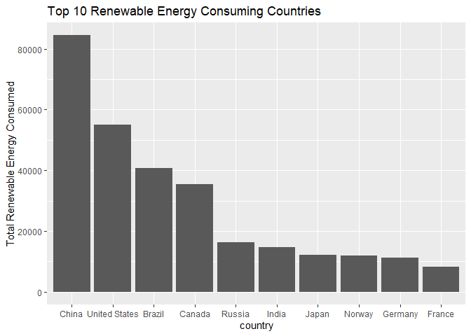<!-- --> Looking at
these graphs, most of the top countries are similar for each of the
different types of energy used. For all the types, China and the United
States are both the top 2 countries by a considerable amount, with the
remaining countries having variable positions across the different
energy types.
